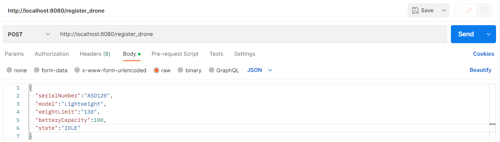
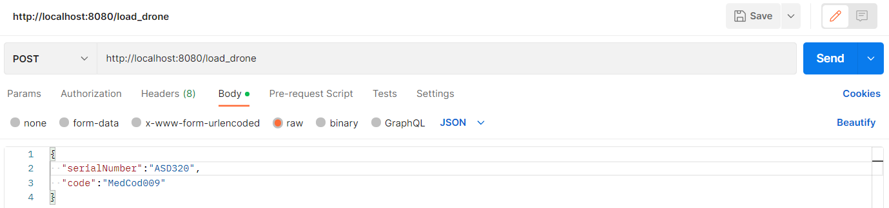

## Drones Service REST API

---

:scroll: **START**

### Introduction

There is a major new technology that is destined to be a disruptive force in the field of transportation: **the drone**. Just as the mobile phone allowed developing countries to leapfrog older technologies for personal communication, the drone has the potential to leapfrog traditional transportation infrastructure.

Useful drone functions include delivery of small items that are (urgently) needed in locations with difficult access.

---

### Task description

We have a fleet of **10 drones**. A drone is capable of carrying devices, other than cameras, and capable of delivering small loads. For our use case **the load is medications**.

A **Drone** has:
- serial number (100 characters max);
- model (Lightweight, Middleweight, Cruiserweight, Heavyweight);
- weight limit (500gr max);
- battery capacity (percentage);
- state (IDLE, LOADING, LOADED, DELIVERING, DELIVERED, RETURNING).

Each **Medication** has: 
- name (allowed only letters, numbers, ‘-‘, ‘_’);
- weight;
- code (allowed only upper case letters, underscore and numbers);
- image (picture of the medication case).

Develop a service via REST API that allows clients to communicate with the drones (i.e. **dispatch controller**). The specific communicaiton with the drone is outside the scope of this task. 

The service should allow:
- registering a drone;
- loading a drone with medication items;
- checking loaded medication items for a given drone; 
- checking available drones for loading;
- check drone battery level for a given drone;

> Feel free to make assumptions for the design approach. 

---

### Requirements

While implementing your solution **please take care of the following requirements**: 

#### Functional requirements

- There is no need for UI;
- Prevent the drone from being loaded with more weight that it can carry;
- Prevent the drone from being in LOADING state if the battery level is **below 25%**;
- Introduce a periodic task to check drones battery levels and create history/audit event log for this.

---

#### Non-functional requirements

- Input/output data must be in JSON format;
- Your project must be buildable and runnable;
- Your project must have a README file with build/run/test instructions (use DB that can be run locally, e.g. in-memory, via container);
- Required data must be preloaded in the database.
- JUnit tests are optional but advisable (if you have time);
- Advice: Show us how you work through your commit history.

---
### How to build

#### Requirements

- Java 8
- Java Framework (Spring Boot API)
- Java IDE (IntelliJ IDEA Community Edition 2022.2.3)
- MYSQL databse Using MySql Workbench 8.0 CE (Database Data)
- Postman(For Testing Purpose Transfer Of Data From API To Database)

### Testing the API

#### Requirements

- Postman
- MySql Workbench

### Services Available in API

-API uses port 8080 of localhost

#### Registration Of Drone

- localhost:8080/register_drone 
- The payload should be in json format like this
- Uses the POST Request

- Response given by API below:

- Output from database 

#### Loading Drone With Medication

- localhost:8080/load_drone 
- The payload should be in json format like this
- Uses the POST Request

- Response given by API below:

- Output from database, the table containing both droneID and MedicationID below

- Output from database, ID of drone below

- Output from database, ID of medication below

#### Checking Loaded Medication On Specific Drone

- localhost:8080/getDroneMedication 
- The payload should be in json format like this
- Uses the GET Request

- Response given by API below:

- Output from database, is the same as Loading Drone With Medication

#### Checking Available Drones For Loading

- localhost:8080/allDroneState
- The payload should be in json format like this
- Uses the GET Request
- You can use this service to find a list of drones of any state but for this service we are looking for the drones with IDLE state

- Response given by API below:

- Output from database

#### Checking The Drone Battery level For A Specific Drone

- localhost:808/getDroneBatteryLevel
- The payload should be in json format like this
- Uses the GET Request

- Response given by API below:

- Output from database

### Functional Requirements

#### Cannot load Medication With Heavier Weight Than The Weight Limit Of Drone

- localhost:8080/load_drone 
- The payload should be in json format like this
- Uses the POST Request

- Response From API below:

#### Drone cannot be in LOADING State if battery is below 25%

- localhost:8080/load_drone 
- The payload should be in json format like this
- Uses the POST Request

-Response From API below:

---

:scroll: **END** 